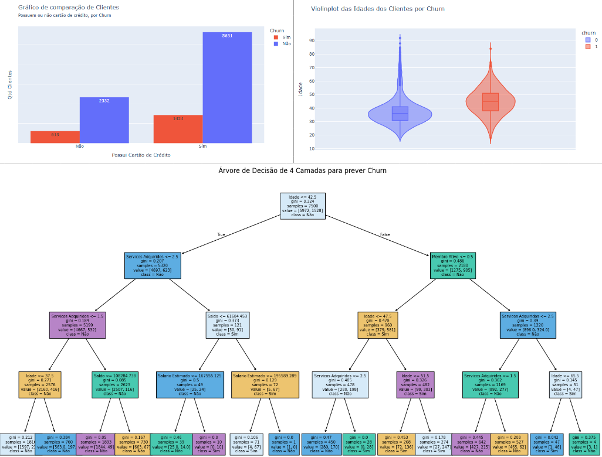

# Análise de Churn

Este projeto tem como objetivo construir modelos para prever a taxa de churn dos clientes de determinado banco.

## Análise Realizada

A análise foi conduzida no Jupyter Notebook [`Analise_de_churn.ipynb`](Analise_de_churn.ipynb). Foram exploradas as variáveis categóricas, variáveis numéricas, e construido modelos de Machine Learning Supervisionados de Classificação para prever se o cliente dará ou não churn.

## Base de Dados

A base de dados utilizada, [`churn.csv`](content/churn.csv), contém informações sobre clientes de determinado banco. Entre os dados temos Score de crédito, idade, se é membro ativo e a variável alvo, se deu churn.

## Bibliotecas Utilizadas

As principais bibliotecas utilizadas, listadas são:

1. **[pandas](https://pandas.pydata.org/)** - Manipulação e análise de dados.
2. **[numpy](https://numpy.org/)** - Operações numéricas e vetoriais.
3. **[matplotlib](https://matplotlib.org/)** - Visualização de dados.
4. **[plotly](https://plotly.com/python/)** - Visualização interativa de dados.
5. **[jupyter](https://jupyter.org/)** - Ambiente interativo para notebooks.
6. **[google colab](https://colab.research.google.com/)** - Ambiente em nuvem interativo para notebooks.
7. **[Scikit-learn](https://sklearn.org/stable/api/sklearn.html)** - Biblioteca de Machine Learning.

## Visualização

